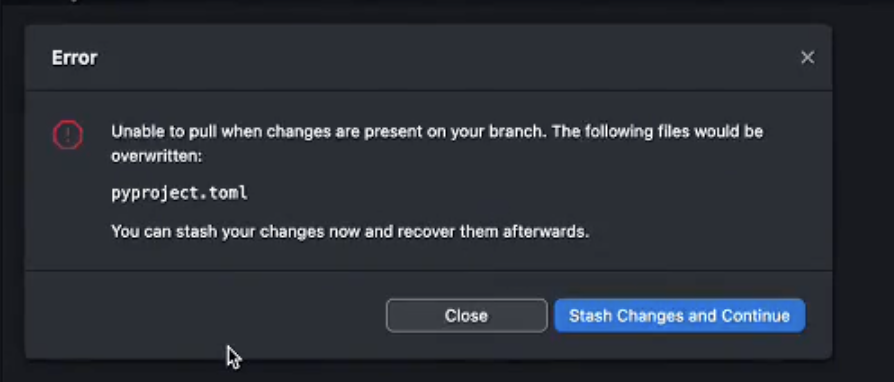
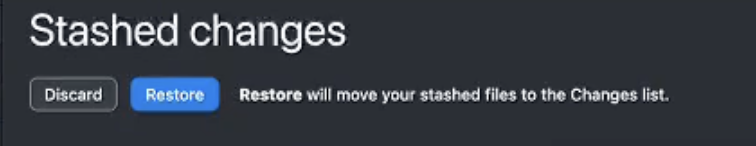

# Git или Гит — система контроля и управления версиями файлов

## Некоторые понятия

1) GitHub или Гитхаб — веб-сервис для размещения репозиториев и совместной разработки проектов.

2) Репозиторий Git — каталог файловой системы, в котором находятся: файлы конфигурации, файлы журналов операций, выполняемых над репозиторием, индекс расположения файлов и хранилище, содержащее сами контролируемые файлы.

3) Локальный репозиторий — репозиторий, расположенный на локальном компьютере разработчика в каталоге. Именно в нём происходит разработка и фиксация изменений, которые отправляются на удалённый репозиторий.

4) Удалённый репозиторий — репозиторий, находящийся на удалённом сервере. Это общий репозиторий, в который приходят все изменения и из которого забираются все обновления.

5) Форк (Fork) — копия репозитория. Его также можно рассматривать как внешнюю ветку для текущего репозитория. Копия вашего открытого репозитория на Гитхабе может быть сделана любым пользователем, после чего он может прислать изменения в ваш репозиторий через пулреквест.

6) Обновиться из апстрима — обновить свою локальную версию форка до последней версии основного репозитория, от которого сделан форк.

7) Обновиться из ориджина — обновить свою локальную версию репозитория до последней удалённой версии этого репозитория.

8) Клонирование (Clone) — скачивание репозитория с удалённого сервера на локальный компьютер в определённый каталог для дальнейшей работы с этим каталогом как с репозиторием.

9) Ветка (Branch) — это параллельная версия репозитория. Она включена в этот репозиторий, но не влияет на главную версию, тем самым позволяя свободно работать в параллельной. Когда вы внесли нужные изменения, то вы можете объединить их с главной версией.

10) Мастер (Master) — главная или основная ветка репозитория.

11) Коммит (Commit) — фиксация изменений или запись изменений в репозиторий. Коммит происходит на локальной машине.

12) Пул (Pull) — получение последних изменений с удалённого сервера репозитория.

13) Пуш (Push) — отправка всех неотправленных коммитов на удалённый сервер репозитория.

14) Пулреквест (Pull Request) — запрос на слияние форка репозитория с основным репозиторием. Пулреквест может быть принят или отклонён вами, как владельцем репозитория.

15) Мёрдж (Merge) — слияние изменений из какой-либо ветки репозитория с любой веткой этого же репозитория. Чаще всего слияние изменений из ветки репозитория с основной веткой репозитория.

16) Кодревью — процесс проверки кода на соответствие определённым требованиям, задачам и внешнему виду.

## Заметки

1) Откройте через проводник папку с вашим репозиторием на компьютере, и включите отображение скрытых папок
Для MacOS shift+command+.

2) Зайдите в скрытую папку .git
Найдем там папку refs
Интересный факт, рядом с папкой refs находится папка hooks, зайдя в неё вы увидите pre-commit,
таким образом, когда вы вводите команду pre-commit install, у yас создаётся эта папка с хуком.

Кнопка в программе GitHub desktop -> push origin - служит для отправки изменений в удаленный репозиторий

Кнопка в программе GitHub desktop -> fetch origin - служит для обновления информации о удаленном репозитории (вдруг там что то изменилось)

Кнопка в программе GitHub desktop -> pull origin - служит для принятия изменений из удаленного репозитория в наш локальный

При операции pull, могут возникнуть конфликтные ситуации, когда программы автоматически не может принять pull из удаленного репозитория, то есть те изменения которые у нас в локальном репозитории, конфликтуют с изменениями которые содержаться в удаленном репозитории. У нас в GitHub desktop произойдет ошибка Error
и появится кнопка -> Stash Changes and Continue Это нам говорит что git hub не знает какое из изменений оставить, которое у нас в локальном репозитории, или то которое в удаленном репозитории. И он предлагает спрятать наши локальные изменения в буфер обмена, а принять изменения из удаленного репозитория.
После того как stash отработал, нужно его восстановить в интерфейсе появится кнопка -> Stashed Changes и после -> Restore. Это добавит к принятым изменениям из удаленного репозитория, наши "припрятанные" (Stash) изменения.
Теперь у нас оба изменения помечены какие от куда взяты, и нам можно:

-> Accept Current Change (принять текущие изменения одного цвета) (пришли с github)

-> Accept Incoming Change (принять входящие изменения другого цвета) (наши локальные)

-> Accept Both Changes (принять оба изменения обоих цветов)

-> Compare Changes (сравнить изменения)

После выбора нужного варианта мы можем нажать -> Resolve in Merge Editor и затем убедившись в правильности нажать -> Complete Merge

Аналог команды гит git stash эта кнопка:

Но в гит, есть намного лучше команда

`git stash save "Мои временные изменения"` - Она в отличие от кнопки в github desktop ещё может сохранить наш стэш под определённым названием и мы сможем в любой момент восстановиться, в отличие от github desktop, если мы случайно нажмём здесь discard то потеряем наши локальные изменения.

то все локальные изменения будут утеряны.

Для того чтобы откатиться к коммиту, если мы накосячили, нужно нажать на -> Revert Changes in Commit

Кнопка создаёт новый коммит, отменяющий изменения текущего коммита. Без удаления самого коммита.

Но что делать, если вы хотите просто посмотреть что было в файле в определенный день?

Другие инструкция:

